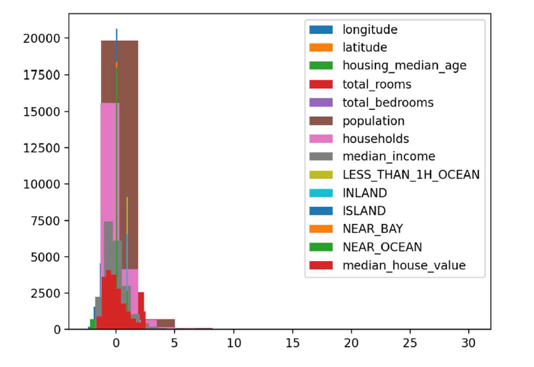
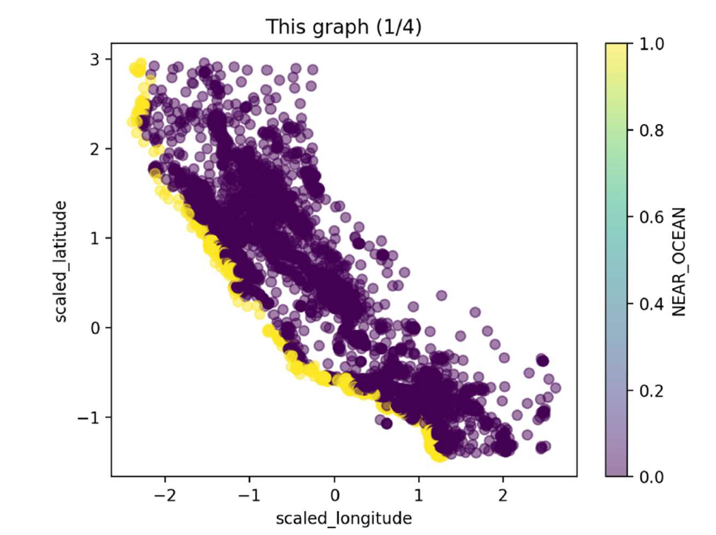
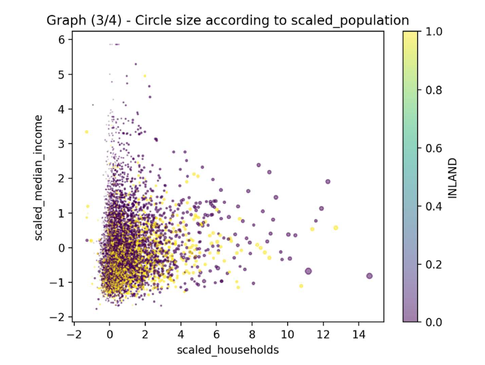

# 🏠Real estate median price prediction using machine learning algorithms
The program implements machine learning models for houses' price prediction, based on houses' characteristics, and shows the classifiers according to the machine learning model. The program calculates mean and absolute square error and uses  10 fold cross validation for each machine learning model.

## ⚡Features
 - 🔢Pre-proccess data:
    - One Hot Vector
    - Scaling data
    - Filling null values with the column's mean value
 - 📝Threshold calculation (threshold is the mean value)
 - 📊Histgram construction
 - 📈Diagrams construction with values (values are divided into four diagramms for visual clarity reasons):
    - 1st: Scaled Longitude, scaled latitude and near ocean columns
    - 2nd: Scaled total rooms, scaled total bedrooms and less than 1h ocean columns
    - 3rd: Scaled households, scaled median income and inland columns
    - 4th: Scaled median house value and island
 - 📈Classifier construction using all data through perceptron algorithm
 - 📈Classifier construction using all data through least squares algorithm
 - 🔟Ten fold cross validation:
    - Using perceptron and least squares algorithm and
    - Mean absolute error calculation
    - Mean square error calculation
 - 🔟Ten fold cross validation:
    - Using multilayer network
      - The model is sequential with 3 layers, learning rate 0.001, 40 epochs, bach size 10 and mean square error loss function
    - Mean absolute error calculation
    - Mean square error calculation

## 🧰Prerequisites

Before running the application, make sure your environment is properly configured.
 - Python 3.9+ is recommended

Required Libraries:
 - Numpy
 - Sci-kit learn
 - keras

# 🧪 How to Run
Clone the repository (or download and decompress the ZIP file).
```bash
git clone https://github.com/theofanistzoumakas/real-estate-price-prediction.git
   cd real-estate-price-prediction
```

Specify the path to your image dataset
```bash
thisfile = pd.read_csv('your_souce_file',delimiter=',');
```
The source file must be a csv file, with columns:
 - longitude
 - latitude
 - housing_median_age
 - total_rooms
 - total_bedrooms
 - population
 - households
 - median_income
 - median_houde_value and
 - ocean_proximity with string values:
    - LESS_THAN_1H_OCEAN
    - INLAND
    - ISLAND
    - NEAR_BAY
    - NEAR_OCEAN
 - Confirm that you have installed the required libraries
 - Run the file.
 - See:
    - Histogram
    - Diagrams
    - General classifier for:
       - Perceptron algorithm
       - Least squares algorithm
    - Classifier for each fold of ten fold corss validation using:
       - Perceptron algorithm
       - Least squares algorithm
       - Multilayer network

## 📸Indicative screenshots




## 🎯Purpose
The purpose of this project was to learn and explore how to extract and analyse data, how to predict values using machine learning algorithms, and how to evaluate machine learning models' performance.

**This application is developed solely for academic and research purposes.**
## 🔒 Code Ownership & Usage Terms
This project was created and maintained by:

Theofanis Tzoumakas (@theofanistzoumakas)

Konstantinos Pavlis (@kpavlis)

Michael-Panagiotis Kapetanios (@KapetaniosMP)

🚫 Unauthorized use is strictly prohibited.
No part of this codebase may be copied, reproduced, modified, distributed, or used in any form without explicit written permission from the owners.

Any attempt to use, republish, or incorporate this code into other projects—whether commercial or non-commercial—without prior consent may result in legal action.

For licensing inquiries or collaboration requests, please contact via email: theftzoumi _at_ gmail _dot_ com .

© 2025 Theofanis Tzoumakas, Konstantinos Pavlis, Michael-Panagiotis Kapetanios. All rights reserved.
